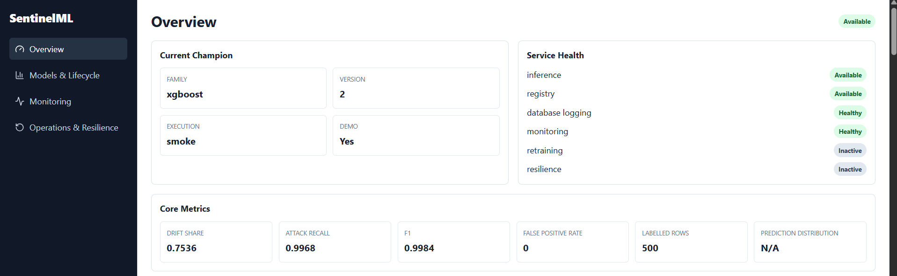
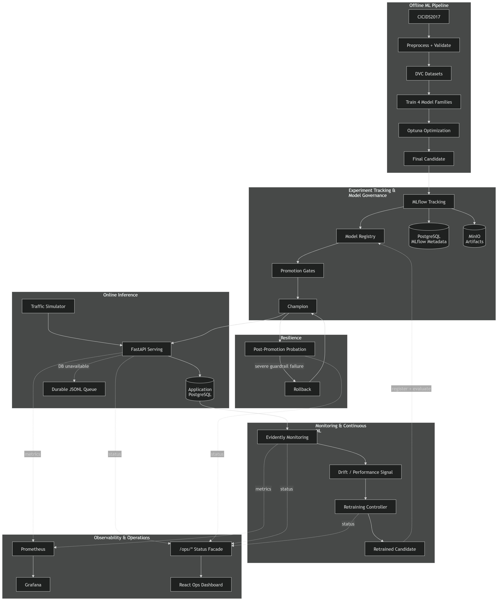
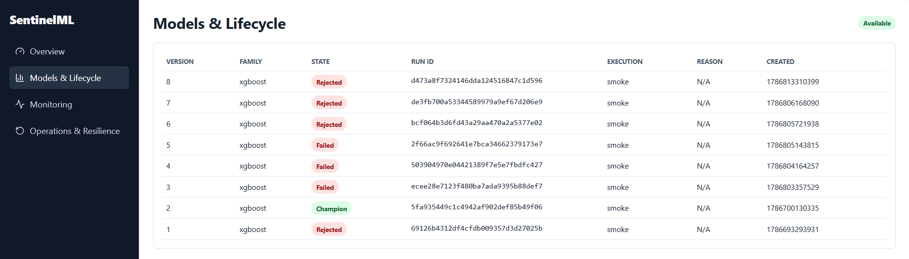
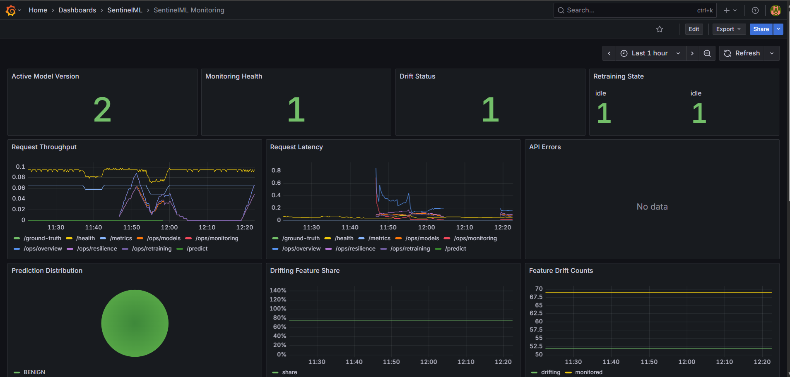
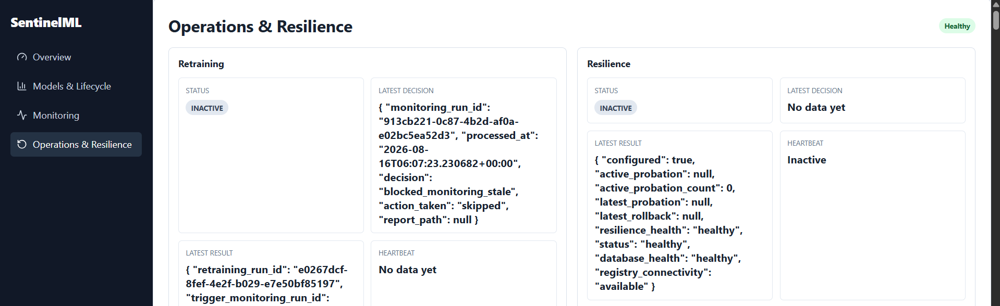

# SentinelML


SentinelML is a local-first, production-style MLOps platform that uses binary network intrusion detection as the production ML use case. The classifier maps CICIDS2017 flow records into `BENIGN -> 0` and `ATTACK -> 1`, but the main point is the lifecycle around the model: data versioning, experiment tracking, governed promotion, inference, observability, retraining, and rollback.

SentinelML is not primarily an ML-modeling project. The intrusion-detection task and conventional model families provide a realistic workload, while the main engineering focus is reproducibility, experiment tracking, model governance, production serving, monitoring, continuous retraining, resilience, and rollback.

## What SentinelML Demonstrates

SentinelML implements reproducible data preparation and DVC pipelines, four conventional model families, Optuna hyperparameter optimization, MLflow experiment tracking, MLflow Model Registry governance, candidate/champion lifecycle management, gated automatic promotion, FastAPI inference, prediction persistence, delayed ground truth, production traffic simulation, Evidently monitoring, Prometheus and Grafana, continuous retraining, cooldown and locking, probation and automatic rollback, failure tolerance, GitHub Actions CI, and a minimal read-only React operations dashboard.



## Architecture



The offline path starts with CICIDS2017 flow-level CSVs, validates and preprocesses them into Parquet partitions, tracks lineage through DVC, trains four traditional model families, and uses Optuna to select a final candidate. MLflow records parameters, metrics, artifacts, and model metadata; PostgreSQL stores MLflow metadata and MinIO stores artifacts.

The online path treats the MLflow `champion` alias as the model source of truth. FastAPI loads the champion into memory, validates request schemas, serves single or batch predictions, and persists prediction records. If database logging fails, records are written to a durable JSONL queue instead of blocking inference.

The feedback loop sends simulator traffic through the real API, records delayed labels, evaluates reference-vs-production drift and delayed-label performance, and exposes service metrics to Prometheus/Grafana and the read-only React dashboard. Retraining can build a new candidate from historical training data plus approved production observations, but lifecycle gates still decide promotion or rejection. Newly promoted champions enter probation, where severe failures can trigger rollback.

## Core Engineering Guarantees

- TEST is reporting-only: Optuna, lifecycle thresholds, and retraining decisions use TRAIN and VALIDATION, not TEST.
- MLflow's `champion` alias is authoritative for serving.
- Drift does not automatically deploy a model; candidates must pass promotion gates.
- Rejected, failed, superseded, and pending candidates remain auditable.
- Inference does not query MLflow on every request; a loaded model can continue serving through MLflow outage.
- Prediction logging failure must not block inference; monitoring failure does not stop inference.
- Stale or unhealthy monitoring blocks blind retraining.
- Retraining uses idempotent monitoring-run processing, a database lock, and cooldown.
- Newly promoted champions enter probation; severe probation failure can trigger rollback.

## Technology Stack

| Responsibility | Technologies |
| --- | --- |
| Machine Learning | Python, scikit-learn, XGBoost, Optuna |
| Data & Reproducibility | Pandas, Parquet, DVC, `pylock.toml` |
| Experiment Tracking | MLflow Tracking Server |
| Model Governance | MLflow Model Registry, aliases, lifecycle tags |
| Serving | FastAPI, Pydantic, Uvicorn |
| Monitoring | Evidently, PSI, Prometheus, Grafana |
| Persistence | PostgreSQL, MinIO, durable JSONL queue |
| Infrastructure | Docker Compose, immutable application images |
| Dashboard | React, TypeScript, Vite |
| Quality / CI | pytest, Ruff, GitHub Actions |

Normal operation is CPU-first. The optional `gpu` extra exists, but CI and Docker runtime paths do not require it.

## Reproducibility & Data Versioning

The data pipeline uses CICIDS2017 flow-level CSVs. `BENIGN` is mapped to `0`; all known non-BENIGN attack labels are mapped to `1`. The split is temporal by weekday rather than random IID: Monday-Wednesday train, Thursday validation, Friday test. A reference partition is sampled from training-period traffic for monitoring.

Preprocessing handles duplicate raw observations, invalid numeric rows, globally constant features, and canonical column names. Provenance columns such as source file/day are preserved for lineage but excluded from training. The committed feature schema contains 69 final model features.

| Partition | Days | Rows | Benign | Attack |
| --- | --- | ---: | ---: | ---: |
| Train | Mon-Wed | 1,526,504 | 1,323,598 | 202,906 |
| Validation | Thu | 398,434 | 396,255 | 2,179 |
| Test | Fri | 595,860 | 375,204 | 220,656 |
| Reference | Mon-Wed sample | 152,695 | 132,459 | 20,236 |

This split tests temporal generalization, but it also means some attacks that appear later in the week may not be represented during training.

DVC tracks pipeline lineage in [dvc.yaml](dvc.yaml) and [dvc.lock](dvc.lock):

```powershell
dvc repro
```

The current `.dvc/config` has no public remote configured. Raw CICIDS2017 data must be acquired separately; do not expect `dvc pull` from a fresh clone to hydrate the dataset unless you configure your own remote.

Model manifests preserve reproducibility metadata including Git commit, DVC state, training and optimization config fingerprints, feature schema fingerprint, random seed, dependency lock hash, and MLflow run information when tracking is enabled.

## Hyperparameter Optimization & Experiment Tracking

Optuna runs separate search spaces for Logistic Regression, Random Forest, XGBoost, and HistGradientBoosting. The objective is validation PR-AUC, maximized with a seeded TPE sampler. Smoke mode samples 20,000 training rows and 10,000 validation rows; full mode uses the configured full partitions. XGBoost uses `MedianPruner + XGBoostPruningCallback`; the other families do not use pruning.

TRAIN and VALIDATION drive optimization. TEST is explicitly not loaded or used for Optuna. MLflow tracking is optional for studies and trials, and only the final winner is eligible to become the final candidate.

Smoke/demo optimization snapshot from [reports/optimization/optimization_summary.json](reports/optimization/optimization_summary.json):

| Family | Trials | Best PR-AUC |
| --- | ---: | ---: |
| HistGradientBoosting | 2 | 0.4366 |
| XGBoost | 2 | 0.3856 |
| Random Forest | 2 | 0.1026 |
| Logistic Regression | 2 | 0.0183 |

These are small-run lifecycle demonstration values, not production benchmark claims.

## MLflow Architecture

MLflow provides three roles: experiment tracking, artifact storage, and registry governance. The Docker stack runs an MLflow Tracking Server backed by PostgreSQL metadata and MinIO artifacts. The Model Registry stores versions of `sentinelml-ids`; lifecycle tags and the `champion` alias drive serving and governance.

SentinelML uses MLflow for experiments, hyperparameters, metrics, candidate training runs, artifacts, model versions, lifecycle metadata, and reload decisions. A fresh empty registry does not contain a champion until the initial lifecycle bootstrap creates and promotes one.



## Model Lifecycle & Governance

The lifecycle states are compact but deliberate:

| State | Meaning |
| --- | --- |
| `candidate` | Registered model version awaiting evaluation or promotion. |
| `champion` | Version pointed to by the MLflow `champion` alias. |
| `rejected` | Candidate failed gates or comparative evaluation. |
| `promotion_pending` | Candidate passed but alias update could not be verified. |
| `superseded` | Former champion replaced by a newer champion. |
| `failed` | Infrastructure/model-load failure during lifecycle work. |

The flow is:

```text
candidate -> evaluate -> PASS -> champion
                     \-> FAIL -> rejected
```

Promotion uses absolute gates for PR-AUC, attack recall, F1, false-positive rate, and inference latency, then a comparative composite score. The current weights are PR-AUC `0.30`, attack recall `0.30`, F1 `0.20`, false-positive rate `0.10`, and latency `0.10`. If MLflow is unavailable during promotion, the candidate can become `promotion_pending`; retry logic re-evaluates against the current champion after registry recovery. Successful promotion can notify serving to reload the champion.

## Traffic & Delayed-Label Simulation

The simulator generates deterministic production-like traffic without Kafka, Redpanda, or external streaming infrastructure. It reads reference data, applies a scenario, sends requests through the real inference API, and can deliver delayed labels.

Available scenarios are `normal`, `gradual_drift`, `sudden_drift`, `attack_rate_spike`, `packet_size_shift`, `flow_duration_shift`, `multi_feature_shift`, and `custom`. Label modes are `randomized`, `batch`, and `none`. Seeds and fingerprints make runs repeatable.

Attack prevalence changes are not automatically equivalent to feature drift: `attack_rate_spike` changes class mix, while drift scenarios transform feature values.

## Monitoring & Observability

Monitoring compares a reference sample against a production window using Evidently and compact PSI signals. Current defaults are window size `500`, minimum window `50`, PSI threshold `0.20`, drift-share threshold `0.30`, and interval `60` seconds. The service reports drifting features, drift share, and delayed-label metrics when enough labels are available: attack recall, F1, and false-positive rate.

Prometheus scrapes API, monitoring, retraining, and resilience metrics; Grafana visualizes the operational dashboard from the Docker provisioning files. Monitoring inputs are fingerprinted so unchanged inputs can skip expensive report generation. Monitoring failures are isolated from inference availability.



## Continuous Retraining

The retraining flow is:

```text
healthy/fresh monitoring signal
-> drift or performance trigger
-> retraining enabled?
-> cooldown clear?
-> lock acquired?
-> enough approved production observations?
-> historical TRAIN + approved production observations
-> fresh retrain of champion family
-> candidate
-> lifecycle gates
-> promote or reject
```

TEST is excluded. Retraining uses only approved production observations, processes each monitoring run idempotently, permits one active run at a time, and applies a cooldown. The current strategy is a fresh retrain of the champion family, with reusable champion-family hyperparameters where available. Retraining defaults to disabled in [configs/retraining_config.yaml](configs/retraining_config.yaml) and [docker/.env.example](docker/.env.example).

## Resilience, Probation & Rollback

New champions enter post-promotion probation. The resilience service can evaluate probation, retry pending promotions, and roll back to a prior version if severe guardrails fail. Manual rollback is available through the CLI.

| Condition | Behavior |
| --- | --- |
| MLflow outage during inference | Already loaded model can keep serving; registry status becomes degraded/unavailable. |
| MLflow outage during promotion | Promotion can become `promotion_pending`; retry rechecks against current champion later. |
| PostgreSQL prediction logging outage | Inference continues; records go to the durable JSONL queue. |
| Monitoring outage or stale monitor | Inference continues; blind retraining is blocked. |
| Model reload failure | Previous loaded model remains active. |
| Candidate gate failure | Candidate is rejected with metadata. |
| Severe probation failure | Automatic rollback can restore an earlier champion. |



## Unified CLI

The current CLI entry point is `sentinelml`.

```text
sentinelml
|-- data
|   |-- prepare
|   `-- eda
|-- train baselines
|-- optimize
|-- candidate build
|-- model
|   |-- status
|   |-- evaluate
|   |-- promote
|   |-- rollback
|   `-- retry-pending
|-- serve
|-- simulate
|-- monitor
|   |-- once
|   `-- status
|-- retrain
|   |-- status
|   |-- evaluate-trigger
|   `-- once
`-- resilience
    |-- status
    |-- evaluate-probation
    `-- rollback
```

| Command group | Purpose | Example |
| --- | --- | --- |
| `data` | EDA and reproducible data preparation | `sentinelml data prepare` |
| `train baselines` | Train baseline families | `sentinelml train baselines --mode smoke` |
| `optimize` | Run Optuna studies | `sentinelml optimize --mode smoke --model xgboost --mlflow` |
| `candidate build` | Train final candidate | `sentinelml candidate build --mode smoke --mlflow` |
| `model` | Registry/lifecycle operations; `promote` and `rollback` are lifecycle-changing | `sentinelml model promote --version 2` |
| `serve` | Start local FastAPI serving | `sentinelml serve` |
| `simulate` | Send production-like traffic to the API | `sentinelml simulate --scenario gradual_drift --requests 100` |
| `monitor` | Run or inspect monitoring | `sentinelml monitor once` |
| `retrain` | Inspect triggers or run retraining; `once` is lifecycle-changing | `sentinelml retrain evaluate-trigger` |
| `resilience` | Probation and rollback; `rollback` is lifecycle-changing | `sentinelml resilience rollback --version 1` |

## Docker & Local Infrastructure

[docker/docker-compose.yml](docker/docker-compose.yml) is the production-like immutable-code stack: application code is baked into images while runtime data/state use mounts and named volumes. [docker/docker-compose.dev.yml](docker/docker-compose.dev.yml) is a development override that bind-mounts local source/configuration into containers. The detailed runbook is [docker/DOCKER_RUNBOOK.md](docker/DOCKER_RUNBOOK.md).

Immutable startup from the repository root:

```powershell
Copy-Item docker\.env.example docker\.env
# Replace every REPLACE_WITH_SECURE_PASSWORD in docker\.env.

docker compose --env-file docker\.env `
  -f docker\docker-compose.yml `
  up -d --build
```

Development mode:

```powershell
docker compose --env-file docker\.env `
  -f docker\docker-compose.yml `
  -f docker\docker-compose.dev.yml `
  up -d --build
```

| Service | Local URL |
| --- | --- |
| Frontend | `http://localhost:8080` |
| API | `http://localhost:8000` |
| MLflow | `http://localhost:5000` |
| Monitor | `http://localhost:9101` |
| Resilience | `http://localhost:9201` |
| Prometheus | `http://localhost:9090` |
| Grafana | `http://localhost:3000` |
| MinIO API / console | `http://localhost:9000` / `http://localhost:9001` |
| PostgreSQL | MLflow `localhost:5433`, app `localhost:5434` |

Useful operations:

```powershell
docker compose --env-file docker\.env -f docker\docker-compose.yml ps
docker compose --env-file docker\.env -f docker\docker-compose.yml logs -f api
docker compose --env-file docker\.env -f docker\docker-compose.yml down
```

Do not routinely use `docker compose down -v`: named volumes contain MLflow metadata, MinIO artifacts, app PostgreSQL state, Prometheus data, and Grafana state. Source edits require rebuilding the affected image in immutable mode.

## Fresh Clone Setup & Intentional Project Scope

### Fresh Clone Setup

1. Clone the repository and create a Python environment.
2. Install the working local stack, for example `python -m pip install ".[dev,ml,tracking,serving,monitoring]"`.
3. Create `docker\.env` from `docker\.env.example` and replace placeholder passwords.
4. Acquire CICIDS2017 separately; this repository has no public DVC remote configured.
5. Place raw CICIDS2017 CSV files under the expected `data\raw\cicids2017\` layout.
6. Run `sentinelml data eda`, then `sentinelml data prepare`.
7. Reproduce tracked data/model stages with `dvc repro` when the raw data is present.
8. Train and optimize: `sentinelml train baselines --mode smoke`, then `sentinelml optimize --mode smoke`.
9. Build the final candidate with MLflow tracking: `sentinelml candidate build --mode smoke --mlflow`.
10. Register and promote the initial champion with the lifecycle bootstrap script: `python scripts/run_phase4_lifecycle.py register-and-promote --mode smoke`. The unified CLI can then inspect/evaluate/promote existing versions with `sentinelml model status`, `sentinelml model evaluate --version <version>`, and `sentinelml model promote --version <version>`.
11. Start the immutable Docker stack and verify the API, frontend, MLflow, and Grafana.

A fresh empty MLflow Registry cannot serve predictions until a champion exists. Existing initialized workspaces can start from their preserved PostgreSQL/MinIO volumes; fresh environments must bootstrap the initial model lifecycle first.

### Intentional Scope & Omitted Features

SentinelML focuses on traditional production ML/MLOps rather than recreating unrelated portfolio features. Advanced model research, architecture experimentation, extensive feature engineering, and benchmark chasing were deliberately not prioritized because the project focuses on MLOps systems engineering rather than maximizing classifier performance. Rich product frontend is intentionally omitted: SentinelML includes a minimal read-only operations dashboard rather than a full product UI. JWT authentication, RBAC, and account/user management are omitted because the project assumes a trusted local environment. Cloud deployment and Kubernetes are omitted because Docker Compose is used to demonstrate the complete local lifecycle. LLM, agentic AI, RAG, and MCP features are deliberately outside scope.

Natural SentinelML-specific extensions would include raw PCAP ingestion, multiclass attacks, Kafka/Redpanda, Feast, SHAP, analyst-review workflows, or distributed training.
